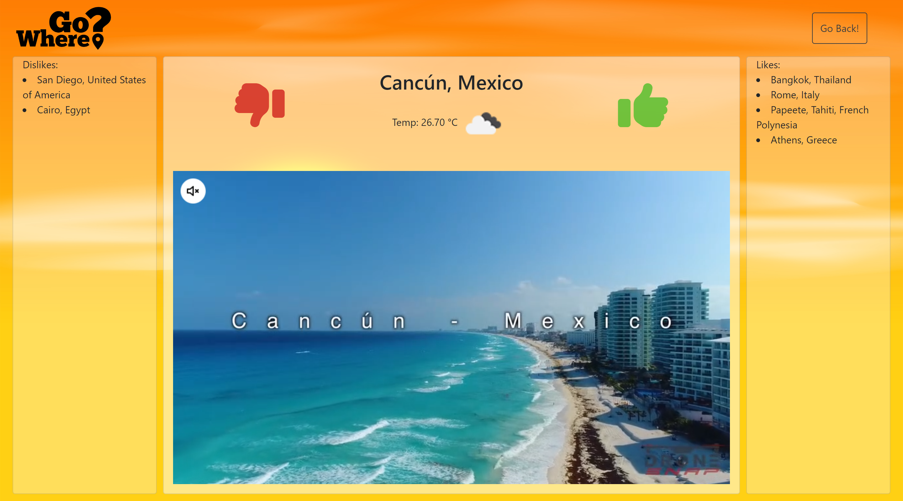
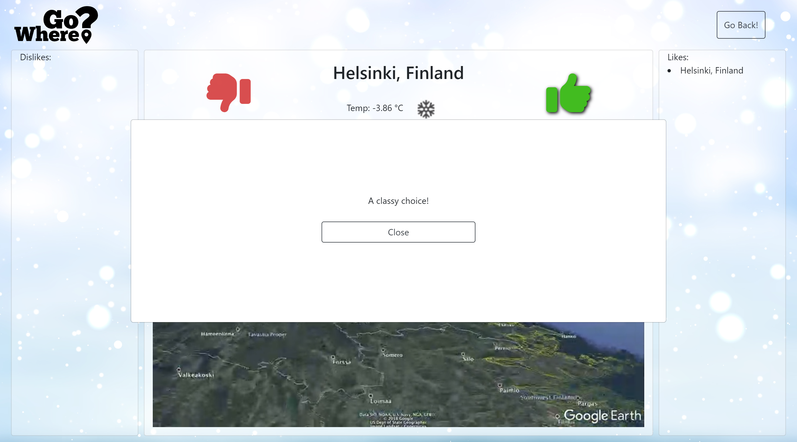
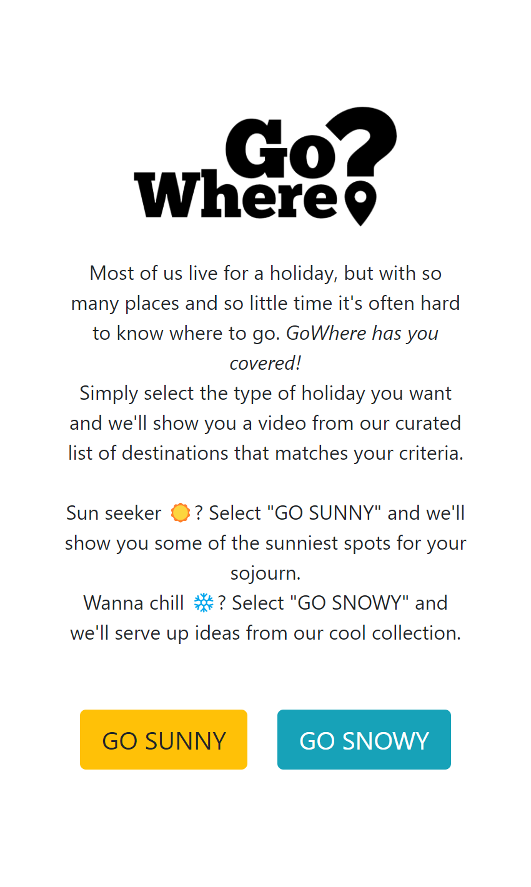

# Go_Where
​[Click to view deployed application](https://cariberrii.github.io/code-quiz-challenge/)

## Table of Contents

- [Desktop View (Screenshots)](#desktop-screenshots)
- [Mobile View (Screenshots)](#mobile-screenshots)
- [User Story](#user-story)
- [Acceptance Criteria](#acceptance-criteria)
- [Built With](#built-with)
- [How to Use](#how-to-use)
- [Code Overview](#code-overview)
- [Acknowledgments](#acknowledgments)
- [License](#license)

## Desktop Screenshots

## Mobile Screenshots

 ### User Story
 **As a** busy professional in need of a holiday,
​ 
 **I want** to be presented with videos for a selection of destinations based around my preference for hot or cold weather.
​ 
 **So that** I can gain inspiration for my next holiday destination.

 ### Acceptance Criteria
This project will be considered successful when:
​
- A user can select a preference for hot or cold weather.
- Videos are displayed to the user based on their preference.
- The user can like or dislike a video.
- The user can change their preference and be shown alternative         destinations.
​
### Built With
- HTML
- CSS
- JavaScript
- jQuery
- Daily Motion API
- Bootstrap
- OpenWeatherMap API
​
### How to use
1. Click either "Go Sunny" or "Go Snowy" to select your preference.
​
2. Like or dislike the video that is displayed.
3. Continue to like or dislike videos and they will be displayed in the "Liked Videos" section or the "Disliked Videos" section respectively.
4. If you change your mind, you can click the "Go Back" button to change your preference and be shown an alternative selection of videos.
​
### Code Overview
The site is predominantly built using JavaScript and jQuery. The site consists of two screens, the first screen is the main selection screen, the second screen is the screen that displays the videos to the user.
​
#### JavaScript
##### destinations.js
This file contains the data for the destinations that are displayed to the user.
​
##### script.js
Contains the logic for transitioning between the two screens which constitute the site - the initial call to action and the display of our video selecton.
​
#### HTML
##### index.html 
Contains the HTML for the main selection screen and the second screen which displays the videos to the user.
​
#### CSS
##### style.css
Contains the styling for the site which overrides some of the default styling provided by Bootstrap.
​
​
### Acknowledgments
- [Aiden Graham](https://github.com/AG466)
- [Cari Fillingham](https://github.com/cariberrii)
- [Edgars Grazulis](https://github.com/grazulisedgars)

- [OpenWeatherMap API](https://openweathermap.org/api)
- [Daily Motion API](https://developer.dailymotion.com/)
- [Bootstrap](https://getbootstrap.com/)
- [jQuery](https://jquery.com/)

## License

MIT License

Copyright (c) 2023 grazulisedgars

Permission is hereby granted, free of charge, to any person obtaining a copy
of this software and associated documentation files (the "Software"), to deal
in the Software without restriction, including without limitation the rights
to use, copy, modify, merge, publish, distribute, sublicense, and/or sell
copies of the Software, and to permit persons to whom the Software is
furnished to do so, subject to the following conditions:

The above copyright notice and this permission notice shall be included in all
copies or substantial portions of the Software.

THE SOFTWARE IS PROVIDED "AS IS", WITHOUT WARRANTY OF ANY KIND, EXPRESS OR
IMPLIED, INCLUDING BUT NOT LIMITED TO THE WARRANTIES OF MERCHANTABILITY,
FITNESS FOR A PARTICULAR PURPOSE AND NONINFRINGEMENT. IN NO EVENT SHALL THE
AUTHORS OR COPYRIGHT HOLDERS BE LIABLE FOR ANY CLAIM, DAMAGES OR OTHER
LIABILITY, WHETHER IN AN ACTION OF CONTRACT, TORT OR OTHERWISE, ARISING FROM,
OUT OF OR IN CONNECTION WITH THE SOFTWARE OR THE USE OR OTHER DEALINGS IN THE
SOFTWARE.
